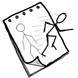
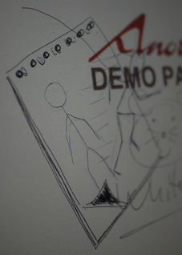
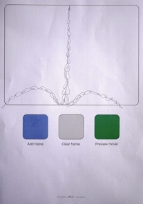

Animator is another application based on digital pen technology, written on my spare time in 2010. 
It uses the same framework I developed at work (described in [WhiteMouse](/whitemouse/), but the actual application is a 
hobby project of mine. I got the idea to make an application that could create 
the kind of simple animations you can create with a pen and a notepad. Plus time 
and patience. 

<iframe width="560" height="315" src="https://www.youtube.com/embed/D5x5rRNdEC8" frameborder="0" allowfullscreen></iframe>

The main reason why I never moved this past the prototype 
stage is that it turned out to be rather boring. Anyone who made it through the 
entire video above understands what I’m talking about. Spending two full minutes 
to create a 2.4 seconds long movie...

 
 

I have lots of other qualities, but I think my lack of drawing talent made itself 
painfully obvious in the Animator movie. I believe I exhausted myself on having 
created the spiffy Animator icon in Gimp only an hour before the video was shot. 

And, coming full circle, I used WhiteMouse to draw the icon in Gimp, using the pen 
as a mouse, see evidence in these pictures. 

To the left, the source on demo paper; to the right, the icon created in Gimp, using WhiteMouse.
And incidentally, the Animator paper shown below – used to draw the actual animation on, as well as controlling parts of the application – was created in a paper design tool my team had developed, not 
documented here. 
 

One key thing that actually made me sit down and write Animator was that I figured that having every frame 
on the same paper would make it easy to draw motion - you can always see where your object were before. 
To some extent that assumption does indeed hold, but it can get awfully messy, and that was one other major 
reason for me to drop it. Not only was it painfully slow to get anything done at all – having all frames of 
the animation on the same paper was less helpful that I had anticipated.
And really, perhaps the biggest reason of all to just let it be - it just wasn’t that much fun.

A final note - I wanted everything to be controlled from the paper, or at least the most common tasks, hence the control areas (”Add frame”, ”Clear frame” and ”Preview movie”). And that part really worked OK.

# Stacks

I rehashed the Animator code for a remarkably more useful application, albeit in an even more prototype kind 
of stage (hence no documentation available), called Stacks. 
Stacks is an aid for creating digital images. It’s based on the Animator code, but instead of creating a movie 
by displaying the drawn frames over time, like Animator does, Stacks saves the frames as a collection of images
meant to be imported in Gimp as layers. Very handy for someone as artisticaly challenged as myself.
