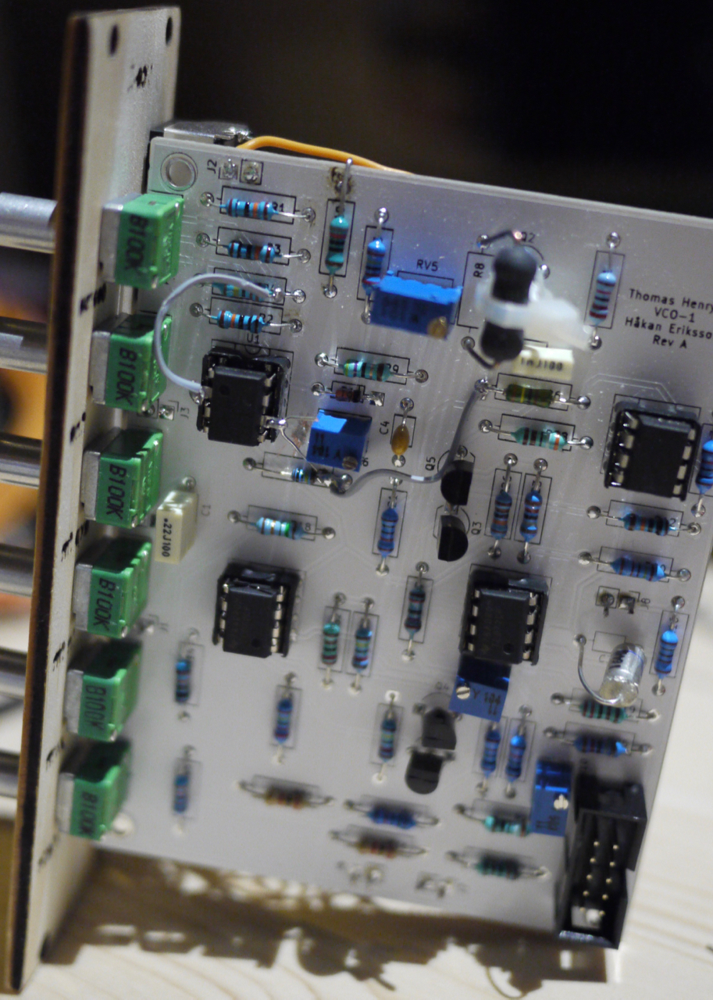

Sometime around 2017 I started to pick up an old interest of mine, audio related electronic. I have some education on the subject – a little from Chalmers, but the most useful stuff I learned at AMU in my mid twenties – as well as experience from repairing stuff (mixer consoles, Hammond organ, amplifiers, effect pedals, etc).
It is unclear why this interest surfaced now, but it is very much fun. 

During the first half of 2018 I arranged workshops for people wanting to build effect pedals. About 10-15 people showed up, and it was very much fun! I am planning to continue with that, but haven't yet decided on what exactly to do (I am leaning towards synthesizers). The main thing I get out of these meetings is seeing people – some with no previous soldering skills at all – put a guitar pedal together. 

The little information site I made at the start of the workshops is quite messy at this point, since I've added info/ramblings about synthesizer projects that may or may not happen, but if you'r ereally interested: <https://bar-and-c.github.io/electronicsoundmachines/>

### CR-78 metallic beat drum
I used to own a Roland CR-78 (still regret selling it) and having access to the schematic I decided to build some of the sounds, starting with the classic Metallic Beat. 

<https://github.com/bar-and-c/electronicsoundmachines/blob/master/metallic_beat>

### Eurorack sequencer
After building a VCO from a kit (Thomas Henry's Maximus) the first thing I attempted to build myself, from scratch, was a super simple sequencer.

<https://github.com/bar-and-c/electronicsoundmachines/blob/master/supersimplesequencer>

The prototype schematic has been given an overhaul that last few days, will probably order an actual PCB for it soon (seems like a good thing to have plenty of).

### Eurorack low pass filter
The second module I've built from scratch was a passive vactrol based low pass filter. Super cheap, super simple – I really love it because it brings a *lot* of value to my so far sparse setup, very much value for very little effort. It is the best thing.

<https://github.com/bar-and-c/electronicsoundmachines/blob/master/passive_aggressive_lpg>

### Eurorack VCO-1
Then, the first PCB I ever made, a straight forward implementation of Thomas Henry's VCO-1.

Even though it was my first PCB, I was convinced it would be flawless, even more so when it arrived, looking very well done – not until I was done and powered it up did I discover several sloppy mistakes. A humbling experience. 
But a few hardware patches later, and it works. 

The panel is laser cut from plywood at STPLN – that worked surprisingly well, at least when the wood fibres are in the correct direction.

<https://github.com/bar-and-c/electronicsoundmachines/tree/master/th-vco-1>

The next PCB, in production at the time of writing, is a VCO based on CEM3340, which I am convinced will be amazingly good (after any potential HW patches).

### Crossover distortion pedal
A distortion pedal that attempts to create crossover distortion (as well as regular fuzz). It is my own idea, augmented by findings online.

<https://github.com/bar-and-c/electronicsoundmachines/blob/master/general_fukup>

